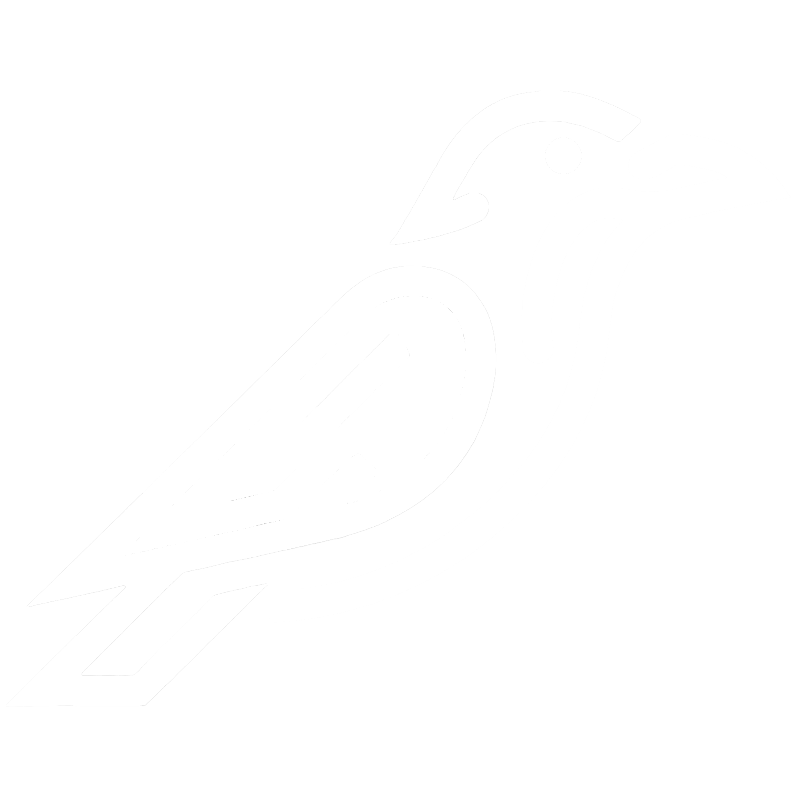
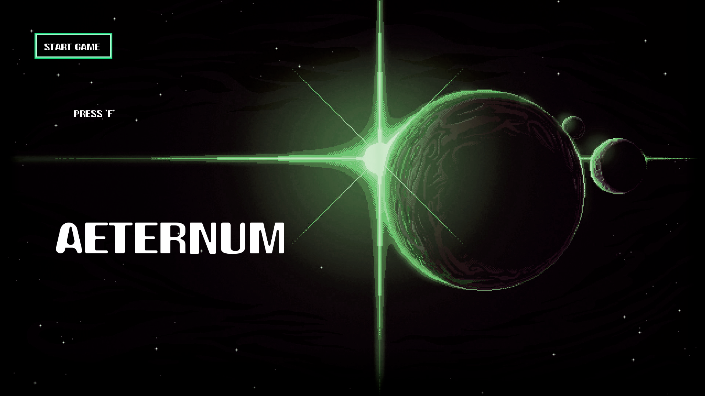
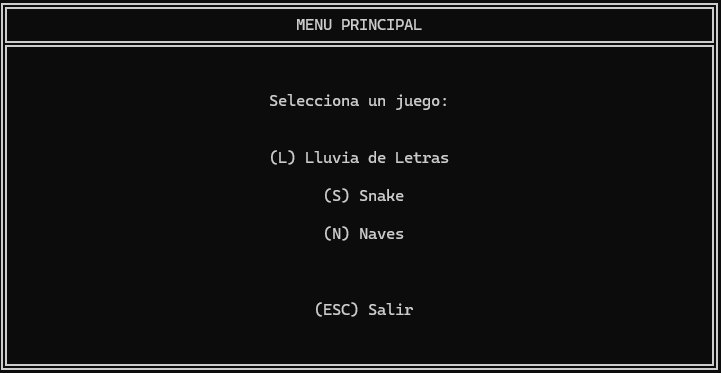
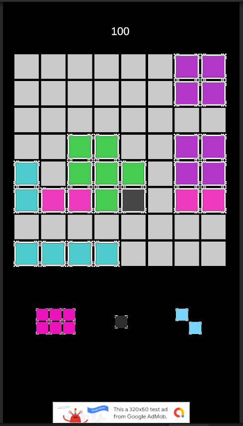

<div align="center">
<!-- ═══════════════════════════════════════════════════════════════ -->
<!--  BANNER · LOGO                                                  -->
<!--  Pon tu archivo en docs/banner.png (o cambia el nombre abajo)   -->
<!-- ═══════════════════════════════════════════════════════════════ -->
 
<!-- OPCIÓN B · Logo cuadrado centrado (descomenta y comenta la A) -->

 
<br/>
<!-- ═══════════════════════════════════════════════════════════════ -->
<!--  TYPING BANNER · Orbitron · violeta neón                        -->
<!-- ═══════════════════════════════════════════════════════════════ -->

<br/>
<p>
  <em>🎮 Game Design & Production graduate · 🐦‍⬛ AbstractRaven</em>
</p>

<p>
  
  
</p>

</div>

---

## 🌌 About Me

```python
class AbstractRaven:
    def __init__(self):
        self.alias       = "AbstractRaven"
        self.role        = "Game Developer"
        self.exploring   = "Engine programming"
        self.education   = "Game Design & Production graduate"
        self.code_in     = ["C#", "C++", "Lua"]
        self.builds_with = ["Unity", "Unreal", "Love2D"]
        self.philosophy  = "Code, balance, and creation"
        self.fuel        = ["caffeine","pixels","lo-fi"]

    def currently(self):
        return [
            "Shipping games and building tools",
            "Diving into engine internals (C++)",
            "Bridging code with art workflows",
            "Every mistake is a lesson, every challenge a chance to grow",
        ]
```

> *Ambitious and creative game developer drawn to both the technical and creative sides of the craft.*
> *Seeking balance between the order of code and the freedom of creativity, passionate about bringing ideas to life through programming.*
> *A mindful approach to game development.*

---

## 🚀 Featured Projects

<!-- CARD 1 · AETERNUM -->

<table>
<tr>
<td width="42%" align="center">
  <a href="https://github.com/absravdev/Aeternum">
    
  </a>
</td>
<td width="58%" valign="top">

### 🎮 [Aeternum](https://github.com/absravdev/Aeternum)

Top-down shooter with **15 levels across 5 planets**, 6 enemy types, upgrade shop with tiered abilities. My first complete shipped game, built in 2–3 weeks while learning to program.

<p>


</p>

<p>


</p>

<a href="https://github.com/absravdev/Aeternum">📖 Code</a> · <a href="https://youtu.be/rTFi5HzEdAk">🎥 Demo</a>

</td>
</tr>
</table>

<!-- CARD 2 · MINI GAME ENGINE -->

<table>
<tr>
<td width="42%" align="center">
  <a href="https://github.com/absravdev/Mini-Game-Engine">
    
  </a>
</td>
<td width="58%" valign="top">

### ⚙️ [Mini Game Engine](https://github.com/absravdev/Mini-Game-Engine)

A small reusable C++ console engine with **three games plugged in through a shared `IGame` interface**. Frame-buffered rendering, fixed-timestep loop, input edge detection. *The engine matters more to me than the games.*

<p>


</p>

<p>


</p>

<a href="https://github.com/absravdev/Mini-Game-Engine">📖 Code</a>

</td>
</tr>
</table>

<!-- CARD 3 · TPV LEARNER -->

<table>
<tr>
<td width="42%" align="center">
  <a href="https://github.com/absravdev/pos-trainer-lua">
    
  </a>
</td>
<td width="58%" valign="top">

### 🍽️ [TPV Learner](https://github.com/absravdev/pos-trainer-lua)

A Lua/Love2D **POS training simulator built while working as a waiter**, so new staff could practice finding products without holding up service. Solved a real workplace problem with code.

<p>


</p>

<p>


</p>

<a href="https://github.com/absravdev/pos-trainer-lua">📖 Code</a>

</td>
</tr>
</table>

<!-- CARD 4 · BLOCK PUZZLE -->

<table>
<tr>
<td width="42%" align="center">
  <a href="https://github.com/absravdev/block-puzzle-unity">
    
  </a>
</td>
<td width="58%" valign="top">

### 🧩 [Block Puzzle](https://github.com/absravdev/block-puzzle-unity)

A **block puzzle game built in Unity with C#**, inspired by classic tile-fitting puzzles. Drag and drop shaped blocks onto a grid, clear full rows and columns, and chain combos for higher scores.

<p>


</p>

<p>


</p>

<a href="https://github.com/absravdev/block-puzzle-unity">📖 Code</a>

</td>
</tr>
</table>

> *Every project README documents what I'd do differently today. Identifying the gap between what I built and what I'd build now is the actual skill that matters.*

---

## 🛠️ Tech Stack

<div align="center">

**Programming**


**Game Engines & Frameworks**


**Art & Design**


**Workflow & Collaboration**


</div>

---

## 📊 GitHub Stats

<div align="center">

<!--  -->
<!--  -->

<br/><br/>


<br/><br/>


</div>

---

## 🐦‍⬛ Connect with AbstractRaven

<div align="center">

<a href="mailto:tu@email.com">
  
</a>
<a href="https://linkedin.com/in/tu-perfil">
  
</a>
<a href="https://twitter.com/tu_handle">
  
</a>
<a href="https://abstractraven.dev">
  
</a>
<a href="https://absravdev.itch.io">
  
</a>

</div>

---

<div align="center">

<em>" Code, balance, and creation, a mindful approach to game development. "</em>

<br/>

<sub>🐦‍⬛ <b>AbstractRaven</b> · Crafted with caffeine and curiosity</sub>

</div>