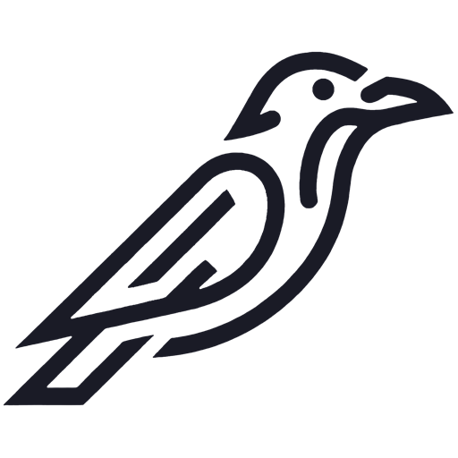
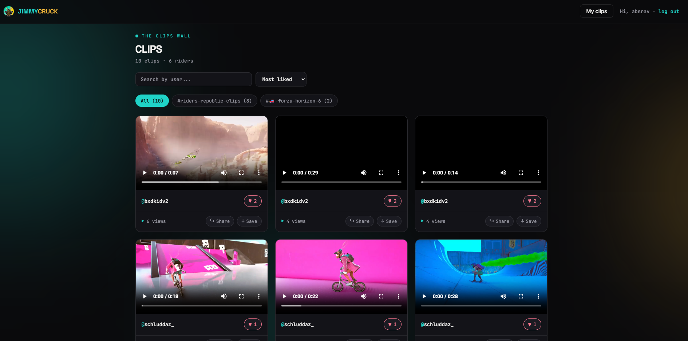
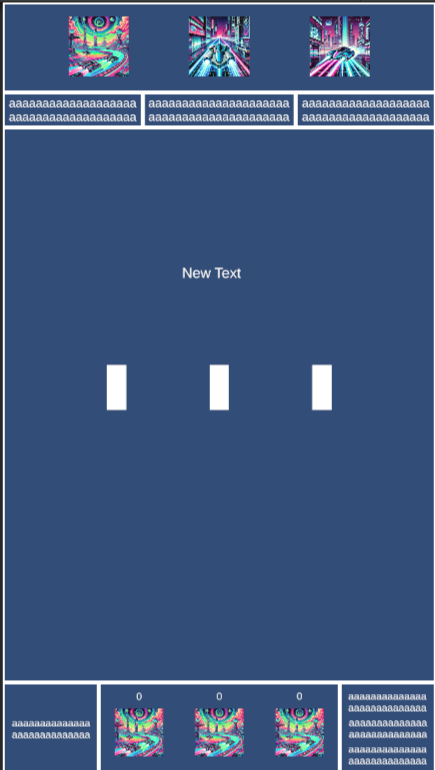

<picture>
  <source media="(prefers-color-scheme: dark)" srcset="docs/logo_absrav.png" />
  
</picture>

# AbstractRaven

Game developer · engine programming · Game Design & Production student

[abstractraven.com](https://abstractraven.com/) · [itch.io](https://absrav.itch.io) · [absravdev@gmail.com](mailto:absravdev@gmail.com)

---

## About

I build games and the systems that keep them running — gameplay in Unity and LÖVE2D, engine internals in C++, and production backends for the web. Final year of a Game Design & Production degree, currently splitting my time between engine programming and operating a SaaS I built end to end.

- Digging into engine internals in C++
- Extending and shipping my own games
- Building and running [Flockery](https://flockery.app), a multi-tenant SaaS for creator communities

## Projects

<table>
<tr>
<td width="40%" align="center">
  
</td>
<td width="60%" valign="top">

### [Flockery](https://flockery.app/)

A managed community platform on top of Discord for content creators, built end to end and run as a multi-tenant SaaS — one codebase, N deployments, zero forks. Creators react to a clip in Discord and it lands on their site instantly; fans log in with Discord to like, rate and compete in a TikTok-style reel with activatable modules (contests, bounties, clip of the week). A React panel drives branding, modules, moderation, stats and email campaigns, all as per-deployment configuration.

Live in production for a ~250K-subscriber YouTuber, plus a public demo. Source private.

`Node.js` `React` `PostgreSQL` `Discord OAuth2` `Cloudflare` `Railway` `Neon` `R2` `Resend`

[Website](https://flockery.app/) · [Demo](https://demo.flockery.app/) · [Live deployment](https://jimmycruck.com/reel) · [Case study](https://github.com/absravdev/discord-clip-portal)

</td>
</tr>
</table>

<table>
<tr>
<td width="40%" align="center">
  
</td>
<td width="60%" valign="top">

### [Aeternum](https://github.com/absravdev/Aeternum)

Top-down shooter with 15 levels across 5 planets, 6 enemy types and a tiered upgrade shop. My first complete shipped game, originally built in 2–3 weeks while learning to program.

Later extended with a global online leaderboard — Node.js + Express on Render backed by PostgreSQL on Neon, with automatic retries and offline caching on the client — and a 2-player LAN co-op mode built on a host-authoritative model over ENet: the host runs the full simulation while the client sends input and renders snapshots, making desync impossible by design.

`Lua` `LÖVE2D` `ENet` `Node.js` `Express` `PostgreSQL` `Render` `Neon`

[Code](https://github.com/absravdev/Aeternum) · [Demo video](https://youtu.be/rTFi5HzEdAk)

</td>
</tr>
</table>

<table>
<tr>
<td width="40%" align="center">
  
</td>
<td width="60%" valign="top">

### [Mini Game Engine](https://github.com/absravdev/Mini-Game-Engine)

A small reusable C++ console engine with three games plugged in through a shared `IGame` interface. Frame-buffered rendering, fixed-timestep loop, input edge detection. The engine matters more to me than the games.

`C++` `Win32` `tinyxml2`

[Code](https://github.com/absravdev/Mini-Game-Engine)

</td>
</tr>
</table>

<table>
<tr>
<td width="40%" align="center">
  
</td>
<td width="60%" valign="top">

### [TPV Learner](https://github.com/absravdev/pos-trainer-lua)

A POS training simulator written while working as a waiter, so new staff could practise finding products without holding up service. A real workplace problem solved with code.

`Lua` `LÖVE2D`

[Code](https://github.com/absravdev/pos-trainer-lua)

</td>
</tr>
</table>

<table>
<tr>
<td width="40%" align="center">
  
</td>
<td width="60%" valign="top">

### [Block Puzzle](https://github.com/absravdev/block-puzzle-unity)

A block puzzle game built in Unity, inspired by classic tile-fitting puzzles. Drag and drop shaped blocks onto a grid, clear full rows and columns, and chain combos for higher scores.

`C#` `Unity`

[Code](https://github.com/absravdev/block-puzzle-unity)

</td>
</tr>
</table>

<table>
<tr>
<td width="40%" align="center">
  
</td>
<td width="60%" valign="top">

### [TikTok Live Arena](https://github.com/absravdev/tiktok-live-arena)

Interactive Unity game wired to TikTok Live, where viewers become the players: the top gift senders take the three racer slots and the chat votes power-ups in real time. An experiment from when interactive streams were peaking.

`C#` `Unity` `TikTok Live API`

[Code](https://github.com/absravdev/tiktok-live-arena)

</td>
</tr>
</table>

> Every project README documents what I'd do differently today. Identifying the gap between what I built and what I'd build now is the actual skill that matters.

## Stack

|  |  |
| :-- | :-- |
| **Languages** | C# · C++ · Lua · JavaScript |
| **Engines** | Unity · Unreal Engine · LÖVE2D |
| **Web & backend** | Node.js · React · Express · PostgreSQL · Cloudflare · Railway · Neon |
| **Art & design** | 3ds Max · Mudbox · Substance · Photoshop · Illustrator |
| **Tools** | Git · Visual Studio · VS Code · Notion · Trello |
